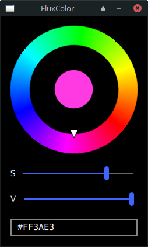

FluxColor (QML Plugin)
======================

About
-----
_FluxColor_ is a light-weight HSV color chooser for Qt >=5.6.
The implementation is purely based on QtQuickControls 2.

Screenshot
----------



How to use
----------

Copy the _FluxColor_ plugin directory to your project resources or add its parent path to your QML import path.
See https://doc.qt.io/qt-5/qqmlengine.html#addImportPath for details on import path handling in C++ projects.

Example (QML)
-------------

```qml
import QtQuick.Controls 2.6
import QtQuick.Controls.Universal 2.6
import FluxColor 1.0 as Flux

ApplicationWindow {
    visible: true

    Universal.theme: Universal.Dark
    // Universal.accent: Universal.Violet

    minimumWidth: colorChooser.width
    minimumHeight: colorChooser.height
    maximumWidth: minimumWidth
    maximumHeight: minimumHeight

    title: "Select Color"

    Flux.ColorChooser {
        id: colorChoooser
    }
}
```
